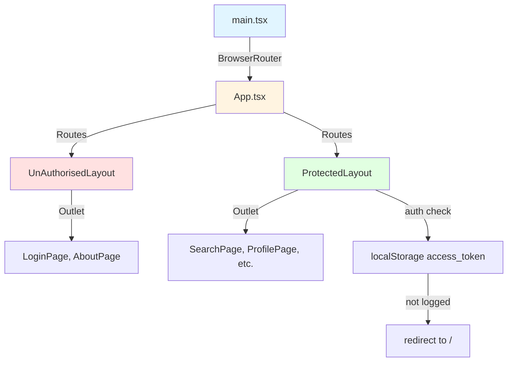

## Анализ роутинга в проекте pikvik-front-v2

Я изучил структуру роутинга в этом проекте. Вот основные паттерны:

### Архитектура роутинга



### Ключевые паттерны

| Компонент | Описание | Файл |
|-----------|----------|------|
| **BrowserRouter** | Корневой роутер | [`main.tsx`](src/main.tsx:3) |
| **Routes** | Централизованная конфигурация | [`App.tsx`](src/App.tsx:28) |
| **Layouts** | Обёртки для группировки роутов | [`UnAuthorisedLayout`](src/shared/ui/UnAuthorisedLayout/UnAuthorisedLayout.tsx:5), [`ProtectedLayout`](src/shared/ui/ProtectedLayout/ProtectedLayout.tsx:8) |
| **URL Helpers** | Генераторы путей | `bundle/*/urls/*.ts` |
| **urlHelper** | Централизованный конструктор URL | [`urlHelper.ts`](src/helpers/urlHelper.ts:3) |

### Структура URL-файлов

Каждый фича-бандл содержит директорию `urls/` с файлом вида `getFeatureUrl.ts`:

```typescript
// Пример: bundle/Search/urls/getSearchUrls.ts
import { urlHelper } from '@/helpers/urlHelper.ts';

export const getSearchUrl = () => {
  return urlHelper('/search');
};

export const getSearchPath = () => getSearchUrl();
```

### Паттерн для роутов с параметрами

```typescript
// bundle/Advertisement/_details/urls/getAdvertisementDetailsUrl.ts
export const getAdvertisementDetailsUrl = (id: string = ':id', currencyId?: string) => {
  return urlHelper(`/advertisement/${id}/details/${currencyId}`);
};

export const getAdvertisementDetailsPath = () => getAdvertisementDetailsUrl(':id', ':currencyId');
```

---

## Промт для рефакторинга другого проекта

Ниже приведён готовый промт, который можно использовать для рефакторинга роутинга в другом проекте:

---

# Промт: Рефакторинг роутинга по паттерну pikvik-front-v2

## Контекст

Я хочу рефакторить роутинг в своём React-проекте, используя архитектуру из проекта pikvik-front-v2. В этом проекте используется React Router v7 с централизованной конфигурацией роутов и модульной системой генерации URL.

## Текущая структура проекта

[ОПИШИТЕ ТЕКУЩУЮ СТРУКТУРУ РОУТИНГА ВАШЕГО ПРОЕКТА]

## Требования к рефакторингу

### 1. Централизованная конфигурация роутов

Создайте файл `App.tsx` (или обновите существующий) с централизованной конфигурацией всех роутов:

```typescript
import { Route, Routes } from 'react-router';
import { UnAuthorisedLayout } from './shared/ui/UnAuthorisedLayout/UnAuthorisedLayout.tsx';
import { ProtectedLayout } from './shared/ui/ProtectedLayout/ProtectedLayout.tsx';
// Импорты страниц...

export const App = () => {
  return (
    <Routes>
      {/*UNAUTHORIZED ROUTE*/}
      <Route element={<UnAuthorisedLayout />}>
        <Route path={getLoginPath()} element={<LoginPage />} />
        {/* другие публичные роуты */}
      </Route>

      {/*AUTHORIZED ROUTE*/}
      <Route element={<ProtectedLayout />}>
        <Route path={getSearchPath()} element={<SearchPage />} />
        {/* другие защищённые роуты */}
        <Route path='*' element={<NotFoundPage />} />
      </Route>
    </Routes>
  );
};
```

### 2. Создайте Layout-компоненты

**UnAuthorisedLayout** — для публичных страниц:
```typescript
import { Outlet } from 'react-router';

export const UnAuthorisedLayout = () => {
  return (
    <Layout isLoggedUser={false}>
      <Outlet />
    </Layout>
  );
};
```

**ProtectedLayout** — для защищённых страниц с проверкой авторизации:
```typescript
import { Outlet, useNavigate } from 'react-router';
import { useEffect } from 'react';

export const ProtectedLayout = () => {
  const isLoggedUser = /* ваша проверка авторизации */;
  const navigate = useNavigate();

  useEffect(() => {
    if (!isLoggedUser) {
      navigate(getLoginUrl());
    }
  }, [isLoggedUser]);

  return (
    <Layout isLoggedUser={isLoggedUser}>
      <Outlet />
    </Layout>
  );
};
```

### 3. Создайте urlHelper

Создайте файл `src/helpers/urlHelper.ts`:

```typescript
export const urlHelper = (uri: string, params?: Record<string, string>): string => {
  let url = uri;

  if (params && Object.keys(params)?.length) {
    const searchParamsString = new URLSearchParams(params).toString();
    url = `${url}?${searchParamsString}`;
  }

  return url;
};
```

### 4. Создайте URL-генераторы для каждого фича-модуля

Для каждой страницы/фичи создайте файл `urls/getFeatureUrl.ts`:

**Для простых роутов:**
```typescript
import { urlHelper } from '@/helpers/urlHelper.ts';

export const getFeatureUrl = () => {
  return urlHelper('/feature-path');
};

export const getFeaturePath = () => getFeatureUrl();
```

**Для роутов с параметрами:**
```typescript
import { urlHelper } from '@/helpers/urlHelper.ts';

export const getFeatureUrl = (id: string = ':id', optionalParam?: string) => {
  return urlHelper(`/feature/${id}/sub-path/${optionalParam}`);
};

export const getFeaturePath = () => getFeatureUrl(':id', ':optionalParam');
```

### 5. Организация файловой структуры

```
src/
├── App.tsx                    # Централизованная конфигурация роутов
├── main.tsx                   # BrowserRouter
├── helpers/
│   └── urlHelper.ts          # Утилита для генерации URL
├── shared/
│   └── ui/
│       ├── Layout/
│       │   └── Layout.tsx    # Базовый layout
│       ├── UnAuthorisedLayout/
│       │   └── UnAuthorisedLayout.tsx
│       └── ProtectedLayout/
│           └── ProtectedLayout.tsx
└── bundle/                   # Фича-модули
    ├── Feature1/
    │   ├── Feature1Page.tsx
    │   └── urls/
    │       └── getFeature1Url.ts
    ├── Feature2/
    │   ├── Feature2Page.tsx
    │   └── urls/
    │       └── getFeature2Url.ts
    └── ...
```

## Конвенции именования

| Тип | Имя функции | Назначение |
|-----|-------------|------------|
| URL-генератор | `getFeatureUrl()` | Возвращает полный URL для навигации |
| Path-генератор | `getFeaturePath()` | Возвращает path с параметрами-плейсхолдерами для `<Route>` |

## Задачи для выполнения

1. [ ] Создать/обновить `main.tsx` с `BrowserRouter`
2. [ ] Создать `urlHelper.ts` в `src/helpers/`
3. [ ] Создать Layout-компоненты (`UnAuthorisedLayout`, `ProtectedLayout`)
4. [ ] Для каждого фича-модуля создать `urls/getFeatureUrl.ts`
5. [ ] Обновить `App.tsx` с централизованной конфигурацией роутов
6. [ ] Заменить все хардкодные строки путей на вызовы URL-генераторов
7. [ ] Обновить все `useNavigate()` и `<Link>` для использования URL-генераторов

## Дополнительные требования

- Использовать TypeScript для типизации параметров URL
- Добавить JSDoc комментарии для URL-генераторов
- Обеспечить единообразие в именовании файлов и функций
- Добавить обработку ошибок для некорректных параметров

---

Этот промт можно адаптировать под конкретный проект, заменив секцию "Текущая структура проекта" на описание вашей текущей архитектуры роутинга.